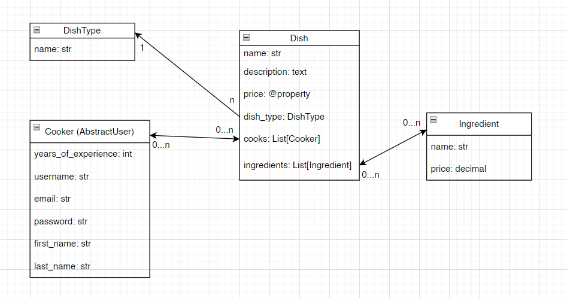
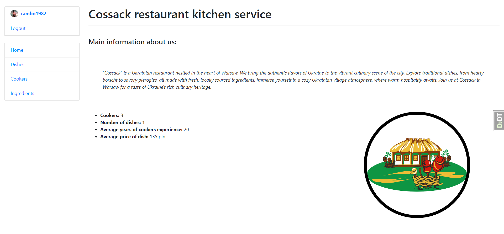

# Cossack Restaurant Kitchen Service


Django project for managing kitchen service

Cossack Restaurant Management System
Welcome to the Cossack Restaurant Kitchen Service! 
This application allows you to keep track of products, chefs,
and dishes in your restaurant. 

To get started, users need to register.
Once registered, you can begin adding ingredients,
creating dishes, and hiring chefs. 
When adding ingredients, be sure to specify their prices,
as the dish prices are calculated based on ingredient costs. 
You can also perform all data manipulations through the admin panel,
including adding dish types (
which cannot be done through the website interface).

Furthermore, through the website interface, you can assign chefs to dishes, 
update data for all database models, and upload photos of chefs and dishes. 
Enjoy using our service!


You should create user or use user from after loading data from test_data.json to db.

## Installation

Python3 must be already installed

For Windows:
```shell
git clone https://github.com/Kurta97/cossack-restaurant-kitchen-service-py-django.git
cd restaurant-kitchen-service-py-django
python venv venv
venv\Scripts\activate
pip install -r requirements.txt
python manage.py makemigrations
python manage.py migrate
python manage.py loaddata test_data.json
python manage.py runserver
```
For Mac (and Linux):
```shell
git clone https://github.com/Kurta97/cossack-restaurant-kitchen-service-py-django.git
cd restaurant-kitchen-service-py-django
python3 -m venv venv
source venv/bin/activate
pip install -r requirements.txt
python manage.py makemigrations
python manage.py migrate
python manage.py loaddata test_data.json
python manage.py runserver
```

## Features

- Create an ingredient
- Edit an ingredient
- Delete an ingredient
- Create a dish
- Edit a dish
- Delete dish
- Read about dish
- Create a cooker
- Edit a cooker
- Delete a cooker
- Read about cooker
- You can use the service only after registration


## DB structure


## Demo

